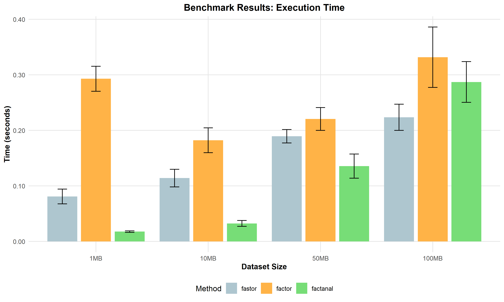
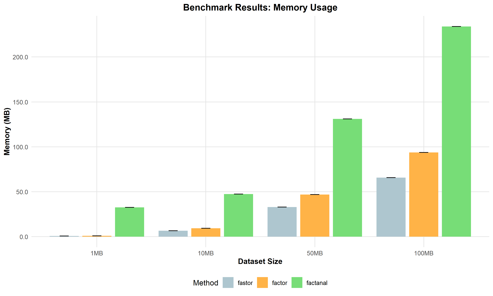

# FastorAnalysis

FastorAnalysis is a performant Factor Analysis library for Python, modeled after R's factanal. FastorAnalysis is intended to provide efficient and scalable factor analysis.

## Table of Contents
- [Introduction](#introduction)
- [Features](#features)
- [Installation](#installation)
- [Usage](#usage)
- [Performance Comparisons](#performance-comparisons)
- [Future Directions](#future-directions)
- [License](#license)

## Introduction

FastorAnalysis is built to address the extremely pressing need for a slightly more performant and less featured factor analysis package in Python. The output stability of the R's factanal, the existing factoranalysis, and the emerging fastoranalysis vary somewhat significantly, however, there are parameter and implementation adjustments that can be made to match a given package more closely. 

## Features

- Fast (for python) and memory-efficient factor analysis implementation
- Support for large datasets
- Accessible API, similar to scikit-learn
- Optimized for both speed and memory usage

## Installation

You can install FastorAnalysis using pip:

```
pip install fastoranalysis
```

## Usage

Here's a quick example of how to use FastorAnalysis:

```python
from fastoranalysis import FactorAnalysis
import numpy as np

# Generate sample data
X = np.random.rand(1000, 20)

# Create and fit the model
fa = FactorAnalysis(n_factors=5)
fa.fit(X)

# Get factor loadings
loadings = fa.loadings_

# Transform data
X_transformed = fa.transform(X)
```

For more detailed usage instructions and API documentation, please refer to [documentation](link-to-your-documentation).

## Performance Comparisons

Here are the results comparing the speed and memory performance of fastoranalysis, factoranalysis, and factanal. 

### Execution Time Comparison



### Memory Usage Comparison



These benchmarks were conducted on datasets ranging from 1MB to 100MB, comparing FastorAnalysis ('fastor') with FactorAnalyzer ('factor') and R's factanal ('factanal'). The numerical values are available at /benchmarks/benchmark_results.csv. 

As the graphs show, fastoranalyis execution time significantly outperforms factoranalysis unilaterally while being slower than factanal for smaller datasets. As dataset size increases, the difference between the execution times shrinks and fastoranalysis outperforms factanal for the 100MB dataset.

The Python implementations use significantly less memory, with fastor using the least memory across every dataset. The reasonably quick performance of fastoranalysis comes at the cost of less safety and general robustness. 

## Future Directions

1. **Input Flexibility**: R's factanal supports formula interfaces and precomputed covariance matricies. 
2. **Additional Rotation Methods**: Expand the available rotation methods beyond varimax and promax.
3. **Incremental Learning**: Develop an incremental learning approach for datasets that don't fit in memory.
4. **Improved Output Formatting**: Implement more robust formatting and viewing options that are consistent with factanal.
6. **Parallel Processing**: Add parallel processing capabilities for multi-core systems.
7. **GPU Acceleration**: Implement cuda based computations for sufficiently large datasets.


## License

Distributed under the MIT License. See `LICENSE` file for more information.
